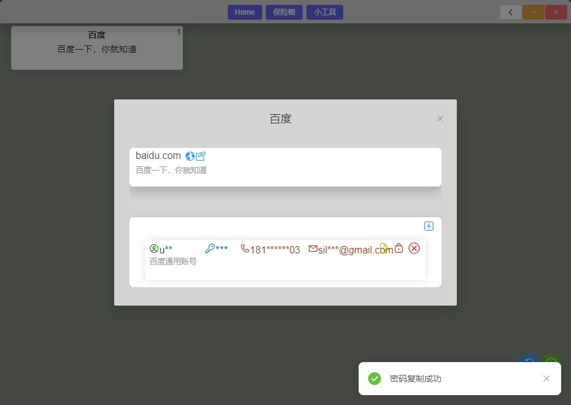

### 使用
1. 下载并安装 [webview2](https://developer.microsoft.com/n-us/microsoft-edge/webview2/)  
2. 下载并安装最新的 [MinGW](https://sourceforge.net/projects/mingw-w64/files/mingw-w64/mingw-w64-release/) 环境，需要手动添加到环境变量。
（一直往下翻，找到 **MinGW-W64 Online Installer** 或 **MinGW-W64 GCC-8.1.0**，下载 `MinGW-W64-install.exe 推荐`   或 `x86_64-posix-sjlj`， `x86_64-win32-sjlj`是32位的）
3. 从 [realease](https://github.com/WanneSimon/PwdBox/releases) 下载程序包，解压并运行 `pwdbox.exe`

### 相关技术
`go-1.18+` 
[wails](https://wails.io/docs/reference/cli) 
[webview2](https://developer.microsoft.com/n-us/microsoft-edge/webview2/) 
`node-v14.18.1`  `vue3`  `vite` 

### 构建
`build` 目录下有不同的构建脚本，此目录下运行即可。 [详细构建参数](https://wails.io/docs/reference/cli#build)  

`wails` 对构建参数 `-webview2` 的说明和一般理解不太一样。  
`-webview2 download` 构建时会下载 `webview2` 并压缩进程序中。
构建时，使用 `-webview2 embed` 比不使用 `-webview2` 时的输出文件大，推荐不使用此选项。  

`-upx` 此参数会压缩构建文件，构建文件体积更小，但可能会被安全软件报毒。 
[下载upx](https://github.com/upx/upx/releases) ，将 upx 放到 `go` `bin` 目录下（确保环境变量中可以使用upx即可）。

构建后，可执行文件同级目录下需要 `config/saya.yml` 和 `config/pwdbox.db3` 才能使用，对应仓库中 `config/saya.yml` 和 `config/pwdbox-init.db3` 。

### Preview

